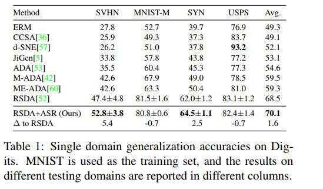

# AFN
A pytorch implementation of Adversarially Adaptive Normalization for Single Domain Generalization.
An official implementation of **AFN: Adaptive Fusion Normalization via Encoder-Decoder Framework** [https://arxiv.org/abs/2308.03321].

# Experiment Results
### Domain Generalization

#### Single domain generalization accuracies on Digits.  

  
This picture shows the digits experiment in ASRNorm. It uses adversarial data augmentation, and only chooses MNIST as the training set, and the other three as the testing set. Furthermore, it increases the channels of MNIST and USPS to make sure these datasets compatible.

- Choosing one as the training set, and the rest as the testing set. (e.g. MNIST->SVHN, USPS, MNIST-M, SVHN->MNIST, USPS, MNIST-M). Iterate about 4 rounds **until each dataset is treated as a training set**, and get the average accuracies. (30 epochs, learning rate 0.1, SGD)
**Don`t use any adversarial augmentation like ASRNorm[https://arxiv.org/pdf/2106.01899.pdf].** **Reduce** the channels of ***M-MNIST and SVHN*** to ensure all datasets are compatible.

|  Method | MNIST  |  SVHN |  USPS |  MNIST-M | Avg.  |
| ------------ | ------------ | ------------ | ------------ | ------------ | ------------ |
| BN  | 74.0  | 30.3  | 73.2  | 38.7  | 54.1  |
|  BIN |  71.4 |  30.6 |  70.6 |  42.5 |  53.8 |
|  ASRNorm | 75.6  | **34.0**  | 70.9  | **45.5**  | 56.5  |
|  AFN | **77.6**  | 33.8  | **73.4**  | 44.8  | **57.4**  |

- Choosing MNIST as the training set, and the rest as the testing set. **Don`t use any adversarial augmentation like ASRNorm[https://arxiv.org/pdf/2106.01899.pdf].** **Increase** the channels of ***MNIST and USPS*** to ensure all datasets are compatible.

|  Method |  SVHN |  USPS |  MNIST-M | Avg.  |
| ------------ | ------------ | ------------ | ------------ | ------------ |
|  BN  | 27.8| 76.9| 52.7| 52.5| 
|  ASRNorm  |**34.1**| 78.5| **64.3**| **59.0**| 
|  AFN  | 33.8| **81.2**| 63.8| **44.8**| 

------------
#### Single domain generalization accuracies on Cifar10-C.
- CIFAR-10 is used as the training domain, while CIFAR-10-C with 
different corruption types and corruption levels are used as the testing 
domains.

|   Method| Level 1  | Level 2  | Level 3   | Level 4  | Level 5   |  Avg. |
| ------------ | ------------ | ------------ | ------------ | ------------ | ------------ | ------------ |
|  BN |  87.8 | 81.5  | 73.2  | 75.5  | 56.1  | 74.8  |
|   ASRNorm|  **89.4** | 86.1  | 82.9  | 78.6  | 72.9  | 82.0  |
|   AFN| 89.3  |**86.6**   |**83.7**   | **79.9**  | **77.0**  | **83.3**  |

------------

#### Single domain generalisation accuracies on PACS. 
- One domain is used as the training set and the other domains are used as the testing set.

|   Method|  Art painting | Cartoon  | Sketch  | Photo  |  Avg. |
| ------------ | ------------ | ------------ | ------------ | ------------ | ------------ |
|  ERM | 70.9  | 76.5  | 53.1  |  42.2 |  60.7 |
| RSC  |  73.4 |  75.9 | 56.2  | 41.6  | 61.8  |
|  RSC+ASRNorm | 76.7  | **79.3**  | **61.6**  | 54.6  | 68.1  |
|  RSC+AFN | **77.3**  | 78.2  | 61.3  | **62.1**  | **69.7**  |

------------
#### Multi-domains generalisation accuracies on PACS. 
- Multi-domain generalisation accuracies on PACS. One domain is used as the test set and the other domains are used as the training sets. During training, we remove the domain labels.

|   Method|  Art painting | Cartoon  | Sketch  | Photo  |  Avg. |
| ------------ | ------------ | ------------ | ------------ | ------------ | ------------ |
|  ERM | 82.7  | 78.7  | 78.6  |  95.1 |  83.8 |
| RSC  |  82.7 |  79.8 | 80.3  | 95.6  | 84.6  |
|  RSC+ASRNorm | **84.8** | 81.8 | 82.6  | **96.1**  | 86.3  |
|  RSC+AFN | 84.4  | **82.4** | **82.9** | **96.1**  | **86.5**  |

------------

### Image Classification

#### CIFAR-10
|  Backbone | BN  | ASRNorm  | AFN  |
| ------------ | ------------ | ------------ | ------------ |
|ResNet18   | 0.9495  | 0.9400  | **0.9515**  |
|ResNet32 | 0.9419  | 0.9308  | **0.9432**  |
|ResNet56 | 0.9450  | 0.9388  | **0.9472**  |
| WRN-16-2  | 0.9404  | 0.9353  | **0.9447**  |
| VGG13  |  0.9179 |  0.9238 | **0.9343**  |
| VGG16  | 0.9435  | 0.9244  | **0.9448**  |
| VGG19  | 0.9442  | 0.9334  | **0.9451**  |

------------

#### CIFAR-100
|  Backbone | BN  | ASRNorm  | AFN  |
| ------------ | ------------ | ------------ | ------------ |
|ResNet18   | 0.7327  | 0.6418  | **0.7457**  |
|ResNet32x4 | 0.7521  | 0.7054  | **0.7569**  |
|ResNet50 | 0.7509  | 0.6830  | **0.7558**  |
| WRN-40-10  | 0.7875  | 0.7538  | **0.7956**  |
| VGG13  |  0.6995 |  0.5150 | **0.7032**  |
| VGG16  | 0.6922  | NAN  | **0.6972**  |

------------

#### M-MNIST
|  Backbone | BN  | ASRNorm  | AFN  |
| ------------ | ------------ | ------------ | ------------ |
|ResNet18   | 0.9880  | 0.9870  | **0.9887**  |
|ResNet32 | 0.9887  | 0.9847  | **0.9893**  |
|WRN16-2 | 0.9859  | 0.9855  | **0.9891**  |
| VGG13  |  0.9830 |  0.9831 | **0.9875**  |
| VGG16  | 0.9838  | NAN  | **0.9849**  |

------------

#### SVHN
|  Backbone | BN  | ASRNorm  | AFN  |
| ------------ | ------------ | ------------ | ------------ |
|ResNet18   | 0.9427  | 0.9441  | **0.9462**  |
|ResNet32| 0.9511  | 0.9472 | **0.9538**  |
| WRN-16-2  | 0.9512  | 0.9489 | **0.9523**  |
| VGG13  |  0.9411 |  0.9409 | **0.9427**  |
| VGG16  | 0.9433  | NAN  | **0.9461**  |

------------

